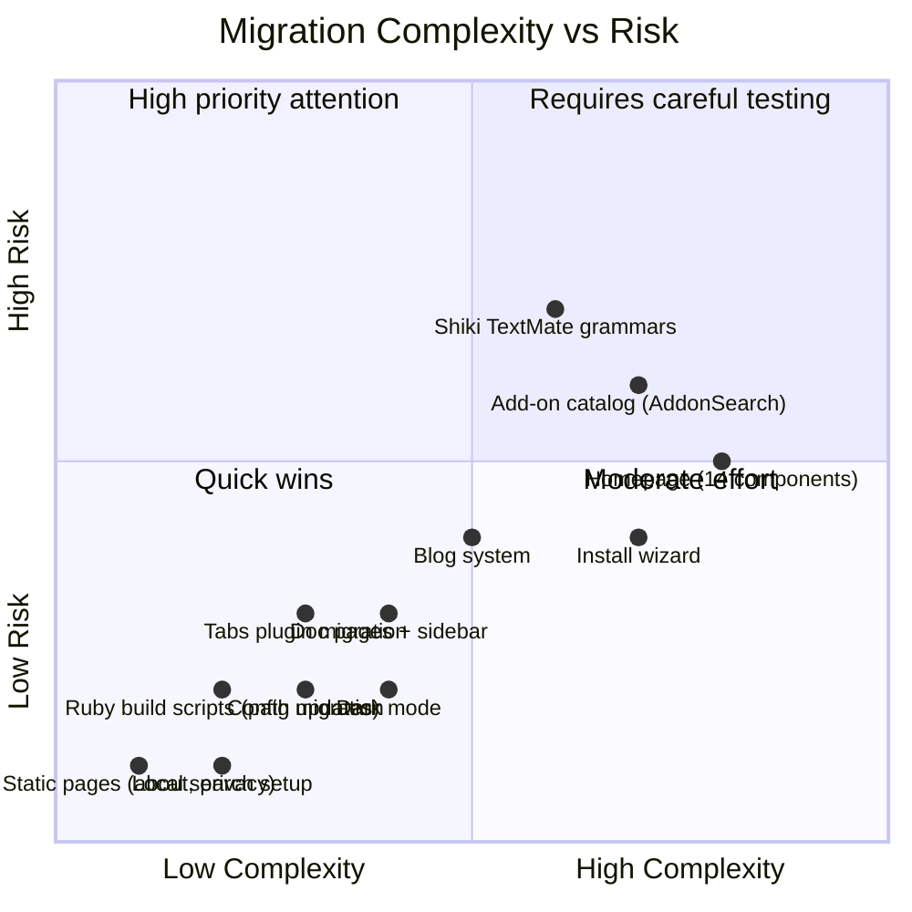

# Migrate openHAB Website from VuePress to VitePress

## Background

The [openHAB website](file:///home/florianh/gitrepos/openhab-website) currently runs on **VuePress 1.7.1** (Vue 2, Webpack, Node <17). VuePress 1.x is unmaintained and pins the project to legacy tooling. VitePress (Vue 3, Vite, ESM-native) is its spiritual successor and is actively maintained.

The openHAB Foundation website was [successfully migrated in PR #110](https://github.com/openhabfoundation/openhabfoundation.github.io/pull/110), providing a proven pattern to follow. That migration used **VitePress ^1.6.4** with **Vue ^3.5.40**, extended the DefaultTheme, and refactored all components from Vue 2 Options API to Vue 3 Composition API (`<script setup>`).

> [!IMPORTANT]
> The live deployment at `https://next.openhab.org` currently serves the **old VuePress 1.7.1** build (confirmed via `<meta name="generator" content="VuePress 1.7.1">`). This migration starts from scratch.

---

## Decisions

| Question              | Decision                                                                     |
|-----------------------|------------------------------------------------------------------------------|
| Homepage design scope | Minor design refreshes allowed, but no overall redesign. Retain look & feel. |
| Build scripts (Ruby)  | **Keep as-is** — recently modernized, no changes needed.                     |
| Search                | **Disable Algolia**. After migration, use VitePress built-in local search.   |
| Feed generation       | Use **`vitepress-plugin-rss`**.                                              |
| Google Analytics      | **Keep as-is** (`UA-47717934-1`), `ConsentBanner` component remains.         |
| Tabs plugin           | Use **`vitepress-plugin-tabs`**.                                             |
| Syntax highlighting   | Create **custom Shiki TextMate grammars** for openHAB DSL and Rules.         |
| Node.js version       | **Node.js 24 LTS**.                                                          |

---

## Proposed Changes

The migration is organized into 7 phases. Each phase is independently testable.

---

### Phase 1: Project Scaffolding & Configuration

Set up the VitePress project structure alongside the existing VuePress setup to enable incremental migration.

#### [NEW] [.vitepress/config.mts](file:///home/florianh/gitrepos/openhab-website/.vitepress/config.mts)

New VitePress configuration file in TypeScript, replacing [`.vuepress/config.js`](file:///home/florianh/gitrepos/openhab-website/.vuepress/config.js). Key mappings:

| VuePress (`.vuepress/config.js`)    | VitePress (`.vitepress/config.mts`)                    |
|-------------------------------------|--------------------------------------------------------|
| `title: 'openHAB'`                  | `title: 'openHAB'`                                     |
| `description: '...'`                | `description: '...'`                                   |
| `dest: 'vuepress'`                  | `outDir` defaults to `.vitepress/dist`                 |
| `head: [...]`                       | `head: [...]` (same format)                            |
| `themeConfig.logo`                  | `themeConfig.logo: { light: '...', dark: '...' }`      |
| `themeConfig.nav`                   | `themeConfig.nav` (slightly different dropdown syntax) |
| `themeConfig.sidebar`               | `themeConfig.sidebar` (import from generated files)    |
| `themeConfig.algolia`               | `themeConfig.search: { provider: 'local' }`            |
| `plugins: ['tabs']`                 | `markdown: { config: (md) => { md.use(tabsPlugin) } }` |
| `extendMarkdown(md)`                | `markdown: { config: (md) => {...} }`                  |
| `configureWebpack` (CopyPlugin)     | `vite: { plugins: [viteStaticCopy({...})] }`           |
| `patterns` (exclude addons)         | `srcExclude: ['addons/**']` (via env var)              |
| `shouldPreload`                     | VitePress handles this automatically                   |
| `@vuepress/plugin-google-analytics` | GA stays in `ConsentBanner` (dynamic script injection) |

**Search**: Replace Algolia DocSearch with VitePress built-in local search:
```typescript
themeConfig: {
  search: {
    provider: 'local',
    options: {
      detailedView: true,
    }
  }
}
```

**RSS feeds** via `vitepress-plugin-rss`:
```typescript
import { RssPlugin } from 'vitepress-plugin-rss'

export default defineConfig({
  vite: {
    plugins: [
      RssPlugin({
        title: 'openHAB',
        baseUrl: 'https://www.openhab.org',
        filter: (post) => post.filepath.startsWith('blog/'),
      })
    ]
  }
})
```

**Sidebar imports**: The Ruby `prepare-website.rb` script currently generates `.vuepress/addons-*.js` files. These will need their output path changed to `.vitepress/addons-*.js`. The sidebar format requires minor key renames (`title` → `text`, `path` → `link`, `children` → `items`).

#### [MODIFY] [package.json](file:///home/florianh/gitrepos/openhab-website/package.json)

Replace dependencies:

```diff
  "devDependencies": {
-   "@vuepress/plugin-google-analytics": "^1.7.1",
-   "copy-webpack-plugin": "^4.6.0",
-   "vuepress": "^1.0.0",
-   "vuepress-plugin-container": "^2.1.2",
-   "vuepress-plugin-feed": "^0.1.9"
+   "vitepress": "^1.6.4",
+   "vitepress-plugin-rss": "^0.2.0",
+   "vitepress-plugin-tabs": "^0.5.0",
+   "vue": "^3.5.40",
+   "vite-plugin-static-copy": "^2.3.0"
  },
  "dependencies": {
-   "headroom.js": "^0.9.4",
-   "markdown-it": "^8.4.2",
-   "scrollreveal": "^3.4.0",
-   "sockjs-client": "^1.6.1",
-   "vue-parallax": "^1.1.1",
-   "vue-parallax-js": "github:jsnanigans/vue-parallax-js",
-   "vue-parallaxy": "^1.1.1",
-   "vue-tabs-component": "^1.5.0",
-   "vue-tweet-embed": "^2.4.0",
-   "vuepress-plugin-tabs": "^0.3.0"
+   "scrollreveal": "^4.0.9",
+   "@lucien144/vue3-parallaxy": "^0.1.2",
+   "headroom.js": "^0.12.0"
  },
  "engines": {
-   "node": "<17"
+   "node": ">=24"
  },
  "scripts": {
-   "dev": "npx vuepress dev",
-   "build-only": "vuepress build ."
+   "dev": "vitepress dev",
+   "build": "npm run prepare-website && ruby scripts/add-blog-meta.rb && vitepress build",
+   "build-only": "vitepress build",
+   "preview": "vitepress preview"
  }
```

Key dependency changes:
- `scrollreveal` 3.x → 4.x (Vue 3 compatible, dynamic import in `onMounted`)
- `vue-parallaxy` → `@lucien144/vue3-parallaxy` (Vue 3 fork, same approach as Foundation migration)
- `headroom.js` → latest (same API, updated)
- `vitepress-plugin-rss` — replaces `vuepress-plugin-feed`
- `vitepress-plugin-tabs` — replaces `vuepress-plugin-tabs`
- Remove: `vue-parallax`, `vue-parallax-js`, `vue-tabs-component`, `vue-tweet-embed`, `sockjs-client`, `markdown-it` (client-side), all VuePress plugins, webpack tooling
- Add: `vitepress`, `vue` 3.x

#### [MODIFY] [.node-version](file:///home/florianh/gitrepos/openhab-website/.node-version) / [.nvmrc](file:///home/florianh/gitrepos/openhab-website/.nvmrc)

Update to **Node.js 24 LTS**.

#### [MODIFY] [.gitignore](file:///home/florianh/gitrepos/openhab-website/.gitignore)

Add `.vitepress/cache/` and `.vitepress/dist/`.

---

### Phase 2: Theme & Layout System

Create the custom theme extending VitePress DefaultTheme. This is the architectural foundation.

#### [NEW] [.vitepress/theme/index.ts](file:///home/florianh/gitrepos/openhab-website/.vitepress/theme/index.ts)

```typescript
import { h } from 'vue'
import type { Theme } from 'vitepress'
import DefaultTheme from 'vitepress/theme'
import './style.css'
import './openhab.css'

// Layouts
import HomeLayout from '../layouts/HomeLayout.vue'
import AboutPage from '../layouts/AboutPage.vue'
import BlogIndex from '../layouts/BlogIndex.vue'
import BlogPost from '../layouts/BlogPost.vue'
import Event from '../layouts/Event.vue'

// Components
import Footer from '../components/Footer.vue'
import DocPreviousVersions from '../components/DocPreviousVersions.vue'
import AddonSearch from '../components/AddonSearch.vue'
import InstallInstructions from '../components/InstallInstructions.vue'
import HomeSections from '../components/HomeSections.vue'
// ... all other components used in markdown files

export default {
  extends: DefaultTheme,
  Layout: () => {
    return h(DefaultTheme.Layout, null, {
      'layout-bottom': () => h(Footer),
      'sidebar-nav-before': () => h(DocPreviousVersions),
    })
  },
  enhanceApp({ app }) {
    app.component('HomeLayout', HomeLayout)
    app.component('AboutPage', AboutPage)
    app.component('BlogIndex', BlogIndex)
    app.component('BlogPost', BlogPost)
    app.component('Event', Event)
    app.component('AddonSearch', AddonSearch)
    app.component('InstallInstructions', InstallInstructions)
    app.component('HomeSections', HomeSections)
    // Register all components referenced in markdown
  }
} satisfies Theme
```

**Pattern** (following Foundation PR #110): Extend `DefaultTheme`, use VitePress [layout slots](https://vitepress.dev/guide/extending-default-theme#layout-slots), register custom layout components for frontmatter `layout:` field.

#### [NEW] [.vitepress/theme/style.css](file:///home/florianh/gitrepos/openhab-website/.vitepress/theme/style.css)

Migrate from [`.vuepress/styles/palette.styl`](file:///home/florianh/gitrepos/openhab-website/.vuepress/styles/palette.styl) and [`.vuepress/styles/index.styl`](file:///home/florianh/gitrepos/openhab-website/.vuepress/styles/index.styl):

- Convert Stylus variables to CSS custom properties overriding VitePress defaults:
  ```css
  :root {
    --vp-c-brand-1: #ff6600;      /* was $accentColor */
    --vp-c-brand-2: #e55d00;
    --vp-c-brand-3: #cc5200;
    --vp-home-hero-name-color: #ff6600;
    --vp-font-family-base: 'Open Sans', sans-serif;
  }
  ```
- Convert `@media (prefers-color-scheme: dark)` blocks → VitePress `.dark` class selectors (VitePress adds `.dark` to `<html>` when dark mode is active, providing a built-in toggle button)
- Migrate `@font-face` declarations for Open Sans
- Migrate Headroom.js integration CSS
- Convert responsive breakpoint variables

#### [NEW] [.vitepress/theme/openhab.css](file:///home/florianh/gitrepos/openhab-website/.vitepress/theme/openhab.css)

openHAB-specific styles that don't override VitePress theme variables (homepage sections, blog cards, about page headers, etc.)

---

### Phase 3: Custom Layouts (7 layouts)

Migrate all 7 VuePress layouts from `.vuepress/theme/layouts/` to `.vitepress/layouts/`. Each is converted from Vue 2 Options API to Vue 3 Composition API.

#### [NEW] `.vitepress/layouts/HomeLayout.vue`
**From**: [`.vuepress/theme/layouts/HomeLayout.vue`](file:///home/florianh/gitrepos/openhab-website/.vuepress/theme/layouts/HomeLayout.vue)

Key changes:
- `<script>` → `<script setup lang="ts">`
- `this.$page.frontmatter` → `useData().frontmatter`
- `this.$router` → VitePress `useRouter()`
- `Vue.prototype.Headroom` → `import Headroom from 'headroom.js'` + `onMounted()`
- Contains `<Jumbotron>`, `<HomeSections>`, `<Footer>`, `<ConsentBanner>`
- Opportunity for minor design refreshes (e.g., leveraging VitePress dark mode toggle)

#### [NEW] `.vitepress/layouts/AboutPage.vue`
**From**: [`.vuepress/theme/layouts/AboutPage.vue`](file:///home/florianh/gitrepos/openhab-website/.vuepress/theme/layouts/AboutPage.vue)

Orange animated title header with pattern background. `this.$page.title` → `useData().page.value.title`.

#### [NEW] `.vitepress/layouts/BlogIndex.vue`
**From**: [`.vuepress/theme/layouts/BlogIndex.vue`](file:///home/florianh/gitrepos/openhab-website/.vuepress/theme/layouts/BlogIndex.vue)

Blog listing page. `this.$site.pages` → VitePress `createContentLoader()` for build-time data loading.

#### [NEW] `.vitepress/layouts/BlogPost.vue`
**From**: [`.vuepress/theme/layouts/BlogPost.vue`](file:///home/florianh/gitrepos/openhab-website/.vuepress/theme/layouts/BlogPost.vue)

Individual blog article layout with hero image, author, date. `vue-tweet-embed` → replace with Twitter `<blockquote class="twitter-tweet">` embeds + platform.twitter.com/widgets.js script.

#### [NEW] `.vitepress/layouts/Event.vue`
**From**: [`.vuepress/theme/layouts/Event.vue`](file:///home/florianh/gitrepos/openhab-website/.vuepress/theme/layouts/Event.vue)

Single event page. Straightforward Composition API conversion.

#### [NEW] `.vitepress/layouts/RedirectLayout.vue`
**From**: [`.vuepress/theme/layouts/RedirectLayout.vue`](file:///home/florianh/gitrepos/openhab-website/.vuepress/theme/layouts/RedirectLayout.vue)

Client-side redirector. `this.$page.frontmatter.redirect_to` → `useData().frontmatter.value.redirect_to`.

#### Layout.vue (Default)
The VuePress default `Layout.vue` (which injected `DocPreviousVersions` and `Footer`) is handled by the theme `index.ts` using VitePress layout slots — no separate file needed.

---

### Phase 4: Vue Component Migration (33 components)

All 33 custom Vue components are migrated from Vue 2 Options API to Vue 3 Composition API.

#### General Components (19 files: `.vuepress/components/` → `.vitepress/components/`)

| Component                                                                                                                | Complexity     | Key Changes                                                                                       |
|--------------------------------------------------------------------------------------------------------------------------|----------------|---------------------------------------------------------------------------------------------------|
| [`AddonLogo.vue`](file:///home/florianh/gitrepos/openhab-website/.vuepress/components/AddonLogo.vue)                     | 🟢 Simple      | `this.$page` → `useData()`                                                                        |
| [`AddonSearch.vue`](file:///home/florianh/gitrepos/openhab-website/.vuepress/components/AddonSearch.vue)                 | 🔴 Complex     | `this.$site.pages` → `createContentLoader()` + `useData()`, live search/filter                    |
| [`BlogPostList.vue`](file:///home/florianh/gitrepos/openhab-website/.vuepress/components/BlogPostList.vue)               | 🔴 Complex     | Page collection + sorting → `createContentLoader()`, ScrollReveal → `onMounted()`                 |
| [`CalendarIcon.vue`](file:///home/florianh/gitrepos/openhab-website/.vuepress/components/CalendarIcon.vue)               | 🟢 Simple      | Pure presentational                                                                               |
| [`CommunityTutorials.vue`](file:///home/florianh/gitrepos/openhab-website/.vuepress/components/CommunityTutorials.vue)   | 🟡 Medium      | `fetch()` in `mounted()` → `onMounted()`                                                          |
| [`ConsentBanner.vue`](file:///home/florianh/gitrepos/openhab-website/.vuepress/components/ConsentBanner.vue)             | 🟡 Medium      | Cookie logic + GA script injection → Composition API. **Kept as-is** functionally (GA unchanged). |
| [`DocPreviousVersions.vue`](file:///home/florianh/gitrepos/openhab-website/.vuepress/components/DocPreviousVersions.vue) | 🟡 Medium      | Version selector, env var access                                                                  |
| [`EditPageLink.vue`](file:///home/florianh/gitrepos/openhab-website/.vuepress/components/EditPageLink.vue)               | 🟡 Medium      | `this.$page.path` → `useData()`                                                                   |
| [`HomeSections.vue`](file:///home/florianh/gitrepos/openhab-website/.vuepress/components/HomeSections.vue)               | 🟡 Medium      | Orchestrator, ScrollReveal init                                                                   |
| [`IconsetDisplay.vue`](file:///home/florianh/gitrepos/openhab-website/.vuepress/components/IconsetDisplay.vue)           | 🟢 Simple      | Static content                                                                                    |
| [`InlineImage.vue`](file:///home/florianh/gitrepos/openhab-website/.vuepress/components/InlineImage.vue)                 | 🟢 Simple      | Helper component                                                                                  |
| [`InstallInstructions.vue`](file:///home/florianh/gitrepos/openhab-website/.vuepress/components/InstallInstructions.vue) | 🔴 Complex     | Multi-tab wizard — tabs via `vitepress-plugin-tabs` or internal Vue 3 tab logic                   |
| `PropBlock/Description/Group/Option/Options.vue`                                                                         | 🟢 Simple (×5) | Pure presentational                                                                               |
| [`ScrollOnReveal.vue`](file:///home/florianh/gitrepos/openhab-website/.vuepress/components/ScrollOnReveal.vue)           | 🟡 Medium      | `this.$sr` → dynamic import of ScrollReveal 4.x                                                   |
| [`ThingDocRenderer.vue`](file:///home/florianh/gitrepos/openhab-website/.vuepress/components/ThingDocRenderer.vue)       | 🔴 Complex     | Client-side markdown fetch + render → dynamic import `markdown-it` in `onMounted()`               |

#### Homepage Components (14 files: `.vuepress/components/home/` → `.vitepress/components/home/`)

| Component                                                                                                                             | Complexity | Key Changes                                   |
|---------------------------------------------------------------------------------------------------------------------------------------|------------|-----------------------------------------------|
| [`AlertBannerSection.vue`](file:///home/florianh/gitrepos/openhab-website/.vuepress/components/home/AlertBannerSection.vue)           | 🟢 Simple  | Frontmatter-driven conditional banner         |
| [`AlternativeToSection.vue`](file:///home/florianh/gitrepos/openhab-website/.vuepress/components/home/AlternativeToSection.vue)       | 🟢 Simple  | Static section                                |
| [`CloudSection.vue`](file:///home/florianh/gitrepos/openhab-website/.vuepress/components/home/CloudSection.vue)                       | 🟢 Simple  | Static with images                            |
| [`CommunitySection.vue`](file:///home/florianh/gitrepos/openhab-website/.vuepress/components/home/CommunitySection.vue)               | 🟡 Medium  | Live Discourse API fetch                      |
| [`EventsSection.vue`](file:///home/florianh/gitrepos/openhab-website/.vuepress/components/home/EventsSection.vue)                     | 🟡 Medium  | Page filtering for events + parallax          |
| [`FeaturedAddons.vue`](file:///home/florianh/gitrepos/openhab-website/.vuepress/components/home/FeaturedAddons.vue)                   | 🟢 Simple  | Logo grid                                     |
| [`IntegrateEverythingIcon.vue`](file:///home/florianh/gitrepos/openhab-website/.vuepress/components/home/IntegrateEverythingIcon.vue) | 🟡 Medium  | CSS animation cycling icons                   |
| [`Jumbotron.vue`](file:///home/florianh/gitrepos/openhab-website/.vuepress/components/home/Jumbotron.vue)                             | 🔴 Complex | Hero + interactive phone mockup iframe + CTAs |
| [`OpenSourceSection.vue`](file:///home/florianh/gitrepos/openhab-website/.vuepress/components/home/OpenSourceSection.vue)             | 🟢 Simple  | Static content                                |
| [`OpenhabianSection.vue`](file:///home/florianh/gitrepos/openhab-website/.vuepress/components/home/OpenhabianSection.vue)             | 🟢 Simple  | Static with image                             |
| [`RotatingGearsIcon.vue`](file:///home/florianh/gitrepos/openhab-website/.vuepress/components/home/RotatingGearsIcon.vue)             | 🟢 Simple  | SVG animation                                 |
| [`RunsEverywhereIcon.vue`](file:///home/florianh/gitrepos/openhab-website/.vuepress/components/home/RunsEverywhereIcon.vue)           | 🟡 Medium  | Animated cycling logos                        |
| [`VsCodeSection.vue`](file:///home/florianh/gitrepos/openhab-website/.vuepress/components/home/VsCodeSection.vue)                     | 🟡 Medium  | Parallax code editor preview                  |
| [`WhySection.vue`](file:///home/florianh/gitrepos/openhab-website/.vuepress/components/home/WhySection.vue)                           | 🟡 Medium  | 3-column grid with animated icons             |

**Common migration patterns** (following Foundation PR #110):

1. `export default { data(), mounted(), methods: {} }` → `<script setup lang="ts">` with `ref()`, `onMounted()`, `computed()`
2. `this.$page` / `this.$site` → `const { page, site, frontmatter } = useData()`
3. `<router-link to="...">` → `<a href="...">`
4. `Vue.prototype.$sr = new ScrollReveal()` → dynamic import:
   ```typescript
   onMounted(async () => {
     const ScrollReveal = (await import('scrollreveal')).default
     ScrollReveal().reveal('.reveal-element', { ... })
   })
   ```
5. `vue-parallaxy` → `@lucien144/vue3-parallaxy` (Vue 3 fork, same as Foundation)
6. Asset paths → use VitePress `withBase()` helper
7. `vue-tabs-component` → `vitepress-plugin-tabs` for markdown, custom Vue 3 tab component for in-component tabs (e.g. `InstallInstructions`)

---

### Phase 5: Markdown, Content & Syntax Highlighting

#### Custom Shiki TextMate grammars

Create two TextMate grammar JSON files for the custom openHAB languages, migrating the regex logic from [`highlight-dsl.js`](file:///home/florianh/gitrepos/openhab-website/.vuepress/highlight-dsl.js) and [`highlight-rules.js`](file:///home/florianh/gitrepos/openhab-website/.vuepress/highlight-rules.js):

#### [NEW] `.vitepress/grammars/openhab-dsl.tmLanguage.json`

TextMate grammar for openHAB Item/Sitemap DSL syntax. Scope: `source.openhab-dsl`. Covers:
- Item types: `Color`, `Contact`, `DateTime`, `Dimmer`, `Group`, `Image`, `Location`, `Number`, `Player`, `Rollershutter`, `String`, `Switch`
- Sitemap elements: `Sitemap`, `Frame`, `Text`, `Group`, `Switch`, `Selection`, `Setpoint`, `Slider`, `Colorpicker`, `Chart`, `Webview`, `Mapview`, `Image`, `Video`, `Default`
- Operators, channels, labels, icons, groups

#### [NEW] `.vitepress/grammars/openhab-rules.tmLanguage.json`

TextMate grammar for openHAB Rules DSL syntax. Scope: `source.openhab-rules`. Covers:
- Keywords: `rule`, `when`, `then`, `end`, `val`, `var`, `if`, `else`
- Triggers: `received update`, `received command`, `changed from`, `changed to`, `Channel ... triggered`, `Time cron`, `System started`
- Actions, built-in functions

Register in config:
```typescript
// .vitepress/config.mts
import openhabDsl from './grammars/openhab-dsl.tmLanguage.json'
import openhabRules from './grammars/openhab-rules.tmLanguage.json'

export default defineConfig({
  markdown: {
    languages: [openhabDsl, openhabRules],
    // Map aliases: 'dsl' → openhab-dsl, 'shell'/'sh' → 'bash', 'conf' → 'dsl'
    languageAlias: {
      'dsl': 'openhab-dsl',
      'conf': 'openhab-dsl',
      'rules': 'openhab-rules',
      'shell': 'bash',
      'sh': 'bash',
      'shell_session': 'bash',
    }
  }
})
```

#### Tabs plugin integration

Install and configure `vitepress-plugin-tabs`:
```typescript
// .vitepress/config.mts
import { tabsMarkdownPlugin } from 'vitepress-plugin-tabs'

export default defineConfig({
  markdown: {
    config(md) {
      md.use(tabsMarkdownPlugin)
    }
  }
})
```

```typescript
// .vitepress/theme/index.ts
import { enhanceAppWithTabs } from 'vitepress-plugin-tabs'

export default {
  // ...
  enhanceApp({ app }) {
    enhanceAppWithTabs(app)
    // ...
  }
}
```

Markdown `::: tabs` / `:::tab` syntax from the existing docs should be compatible or require minimal reformatting to match `vitepress-plugin-tabs` syntax (`=tabs` / `== Tab Name`).

#### Frontmatter changes
- `layout: HomeLayout` etc. continues to work (layouts registered as global components)
- `pageClass: homepage` → adjust CSS selectors as needed
- Blog posts: `meta` frontmatter for OG tags → VitePress `transformPageData` or `head` frontmatter

#### Other markdown
- `::: tip` / `::: warning` / `::: danger` → VitePress supports natively (same syntax ✅)
- `linkify: true` → set in VitePress `markdown.linkify: true`

#### Static assets
- `.vuepress/public/` → `.vitepress/public/` (fonts, logos, images, favicons, schemas, javadoc)
- `.vuepress/_redirects` and `.vuepress/_headers` → `.vitepress/public/_redirects` and `.vitepress/public/_headers` (VitePress copies `public/` to dist root automatically, no CopyWebpackPlugin needed)

---

### Phase 6: Build Pipeline & Deployment

#### [MODIFY] [scripts/prepare-website.rb](file:///home/florianh/gitrepos/openhab-website/scripts/prepare-website.rb)

**Minimal changes only** (Ruby scripts stay as-is per decision, but output paths must change):
- Output sidebar files to `.vitepress/` instead of `.vuepress/`
- Update sidebar format keys: `title` → `text`, `path` → `link`, `children` → `items`
- Copy logos to `.vitepress/public/logos` instead of `.vuepress/public/logos`
- Copy `thing-types.json` to `.vitepress/` instead of `.vuepress/`
- Copy schemas/javadoc to `.vitepress/public/` instead of `.vuepress/public/`

> [!NOTE]
> These are path changes only — the Ruby script logic and structure remain unchanged.

#### [MODIFY] [netlify.toml](file:///home/florianh/gitrepos/openhab-website/netlify.toml)

Update build command and publish directory:
```toml
[build]
  command = "npm run build"
  publish = ".vitepress/dist"
```

---

### Phase 7: Cleanup & Removal

After migration is verified and deployed:

#### [DELETE] `.vuepress/` directory

Remove the entire old VuePress directory:
- `config.js`, `enhanceApp.js`
- `theme/` (layouts, components, index.js)
- `components/` (all 33 components — now in `.vitepress/components/`)
- `styles/` (palette.styl, index.styl — now CSS in `.vitepress/theme/`)
- `highlight-dsl.js`, `highlight-rules.js` (migrated to Shiki TextMate grammars)
- `public/` (moved to `.vitepress/public/`)
- `_redirects`, `_headers` (moved to `.vitepress/public/`)

#### Remove legacy config files
- `.ruby-version`, `Gemfile`, `Gemfile.lock` — **keep** (Ruby scripts remain)
- `.rubocop.yml` — **keep**
- Regenerate `package-lock.json` with new dependencies

---

## Migration Risk Assessment



---

## Verification Plan

### Automated Tests
- `vitepress build` completes without errors
- All pages accessible (no 404s) — run a link checker script against the build output
- RSS feed generated and valid XML

### Manual Verification
1. **Homepage**: All 9 sections visible, ScrollReveal animations working, live Discourse stats loading, phone demo iframe functional, parallax effects smooth
2. **Documentation**: Sidebar navigation matches current structure, code blocks highlighted correctly (including DSL/Rules via Shiki grammars), version selector functional
3. **Add-ons**: Search/filter working, addon logos loading, Thing type search functional
4. **Blog**: Post listing sorted correctly, individual posts render with hero images
5. **Download**: OS-specific install instructions rendering, tab switching, copy buttons
6. **About pages**: Orange header banner, pattern background
7. **Dark mode**: VitePress toggle working, all custom components respecting `.dark` class
8. **Search**: VitePress local search returning relevant results across docs, addons, blog
9. **Mobile**: Responsive layouts, hamburger menu, touch interactions
10. **Netlify**: `_redirects` and `_headers` served correctly
11. **Console**: No JavaScript errors on any page
12. **RSS feed**: Valid at expected URL, contains blog posts
